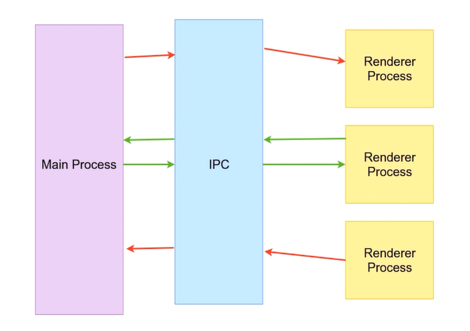

# 主进程和渲染进程

  什么是进程？An instance of a computer program that is being executed

Electron，

## 主进程 - Main Process

- 可以使用和系统对接的Electron API - 创建菜单，上传文件等等
- 创建渲染进程 - Renderer Process
- 全面支持 NodeJS
- 只有一个，作为程序的入口点

## 渲染进程 - Renderer Process

- 可以多个，没个对应一个窗口
- 每个都是要给独立的进程
- 全面支持NodeJS和DOM API

## 第一个应用，创建BrowserWindow

  跟着文档创建一个属于自己的应用，一步一步配置落地。

- npm init, npm i electron -D
- main.js
- 预加载脚本
- 窗口加载HTML，index.html
- renderer.js 控制渲染 DOM API 操作

## 进程之间的通讯方式IPC

Electron 使用 IPC(interprocess communication) 在进程之间进行通讯和 **Chromium** 完全一致


## 预加载脚本

预加载脚本像 Chrome 扩展的 内容脚本（Content Script）一样，会在渲染器的网页加载之前注入。 如果你想向渲染器加入需要特殊权限的功能，你可以通过 contextBridge 接口定义 全局对象。

新建一个 **preload.js** 文件。该脚本通过 versions 这一全局变量，将 Electron 的 process.versions 对象暴露给渲染器。

```js
const { contextBridge } = require('electron')

contextBridge.exposeInMainWorld('versions', {
  node: () => process.versions.node,
  chrome: () => process.versions.chrome,
  electron: () => process.versions.electron,
  // 能暴露的不仅仅是函数，我们还可以暴露变量
})
```

注入到渲染进程

```js
const { app, BrowserWindow } = require('electron')
const path = require('path')

const createWindow = () => {
  const win = new BrowserWindow({
    width: 800,
    height: 600,
    webPreferences: {
      preload: path.join(__dirname, 'preload.js'),
    },
  })

  win.loadFile('index.html')
}

app.whenReady().then(() => {
  createWindow()
})
```

## Electron Forge 打包分发
