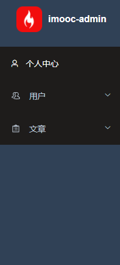

# 定值主题

接下来我们来处理 **动态换肤** 功能。

关于 **动态换肤** 我们之前已经提到过了，在 `layout/components/Sidebar/SidebarMenu.vue` 中，我们实现 `el-menu` 的背景色时，说过：**此处将来会实现换肤功能，所以我们不能直接写死，而需要通过一个动态的值，来进行指定**

```vue
<el-menu
    :default-active="activeMenu"
    :collapse="!$store.getters.sidebarOpened"
    :background-color="$store.getters.cssVar.menuBg"
    :text-color="$store.getters.cssVar.menuText"
    :active-text-color="$store.getters.cssVar.menuActiveText"
    :unique-opened="true"
    router
  >x'z
    ...
  </el-menu>
```

那么换句话而言，想要实现 **动态换肤** 的一个前置条件就是：**色值不可以写死！**

那么为什么会有这个前置条件呢？动态换肤又是如何来去实现的呢？这一小节我们来看一下这个问题。

首先我们先来说一下动态换肤的实现方式。

在 `scss` 中，我们可以通过 `$变量名:变量值` 的方式定义  `css 变量`，然后通过该 `css 变量` 来去指定某一块 `DOM` 对应的颜色。

那么大家可以想一下，如果我此时改变了该 `css 变量` 的值，那么所对应的 `DOM` 颜色是不是也会同步发生变化？

当大量的 `DOM` 都依赖于这个 `css 变量` 设置颜色时，我们是不是只需要改变这个 `css 变量`，那么所有 `DOM` 的颜色是不是都会发生变化，所谓的 **动态换肤** 是不是就可以实现了！

这个就是实现 **动态换肤** 的原理。

而在我们的项目中想要实现动态换肤，需要同时处理两个方面的内容：

1. `element-plus` 主题
2. 非 `element-plus` 主题

那么下面我们就分别来去处理这两块主题对应的内容

## 5-11：动态换肤原理分析

接下来我们来处理 **动态换肤** 功能

关于 **动态换肤** 我们之前已经提到过了，在 `layout/components/SidebarMenu.vue` 中，我们实现 `el-menu` 的背景色时，说过 **此处将来会实现换肤功能，所以我们不能直接写死，而需要通过一个动态的值进行指定**

```html
 <el-menu
    :default-active="activeMenu"
    :collapse="!$store.getters.sidebarOpened"
    :background-color="$store.getters.cssVar.menuBg"
    :text-color="$store.getters.cssVar.menuText"
    :active-text-color="$store.getters.cssVar.menuActiveText"
    :unique-opened="true"
    router
  >
```

那么换句话而言，想要实现 **动态换肤** 的一个前置条件就是：**色值不可以写死！**

那么为什么会有这个前置条件呢？动态换肤又是如何去进行实现的呢？这一小节我们来看一下这个问题。

首先我们先来说一下动态换肤的实现方式。

在 `scss` 中，我们可以通过 `$变量名:变量值` 的方式定义 `css 变量` ，然后通过该 `css` 来去指定某一块 `DOM` 对应的颜色。

那么大家可以想一下，如果我此时改变了该 `css` 变量的值，那么对应的 `DOM` 颜色是不是也会同步发生变化。

当大量的 `DOM` 都依赖这个 `css 变量` 设置颜色时，我们是不是只需要改变这个 `css 变量` ，那么所有 `DOM` 的颜色是不是都会发生变化，所谓的 **动态换肤** 是不是就可以实现了！

这个就是 **动态换肤** 的实现原理

而在我们的项目中想要实现动态换肤，需要同时处理两个方面的内容：

1. `element-plus` 主题
2. 非 `element-plus` 主题

那么下面我们就分别来去处理这两块主题对应的内容

## 5-12：动态换肤实现方案分析

明确好了原理之后，接下来我们就来理一下咱们的实现思路。

从原理中我们可以得到以下两个关键信息：

1. 动态换肤的关键是修改 `css 变量` 的值
2. 换肤需要同时兼顾
   1. `element-plus`
   2. 非 `element-plus`

那么根据以上关键信息，我们就可以得出对应的实现方案

1. 创建一个组件 `ThemeSelect` 用来处理修改之后的 `css 变量` 的值
2. 根据新值修改 `element-plus`  主题色
3. 根据新值修改非 `element-plus`  主题色

## 5-13：方案落地：创建  ThemeSelect 组件

查看完成之后的项目我们可以发现，`ThemeSelect` 组件将由两部分组成：

1. `navbar` 中的展示图标
2. 选择颜色的弹出层

那么本小节我们就先来处理第一个 **`navbar` 中的展示图标**

创建 `components/ThemeSelect/index` 组件

```js
<template>
  <!-- 主题图标  
  v-bind：https://v3.cn.vuejs.org/api/instance-properties.html#attrs -->
  <el-dropdown
    v-bind="$attrs"
    trigger="click"
    class="theme"
    @command="handleSetTheme"
  >
    <div>
      <el-tooltip :content="$t('msg.navBar.themeChange')">
        <svg-icon icon="change-theme" />
      </el-tooltip>
    </div>
    <template #dropdown>
      <el-dropdown-menu>
        <el-dropdown-item command="color">
          {{ $t('msg.theme.themeColorChange') }}
        </el-dropdown-item>
      </el-dropdown-menu>
    </template>
  </el-dropdown>
  <!-- 展示弹出层 -->
  <div></div>
</template>

<script setup>
const handleSetTheme = command => {}
</script>

<style lang="scss" scoped></style>

```

在 `layout/components/navbar` 中进行引用

```vue
<div class="right-menu">
      <theme-picker class="right-menu-item hover-effect"></theme-picker>
      
import ThemePicker from '@/components/ThemeSelect/index'
```

## 5-14：方案落地：创建  SelectColor 组件

在有了 `ThemeSelect` 之后，接下来我们来去处理颜色选择的组件 `SelectColor`，在这里我们会用到 `element` 中的 `el-color-picker` 组件

对于 `SelectColor` 的处理，我们需要分成两步进行：

1. 完成 `SelectColor` 弹窗展示的双向数据绑定
2. 把选中的色值进行本地缓存

那么下面咱们先来看第一步：**完成 `SelectColor` 弹窗展示的双向数据绑定**

创建 `components/ThemePicker/components/SelectColor.vue`

```vue
<template>
  <el-dialog title="提示" :model-value="modelValue" @close="closed" width="22%">
    <div class="center">
      <p class="title">{{ $t('msg.theme.themeColorChange') }}</p>
      <el-color-picker
        v-model="mColor"
        :predefine="predefineColors"
      ></el-color-picker>
    </div>
    <template #footer>
      <span class="dialog-footer">
        <el-button @click="closed">{{ $t('msg.universal.cancel') }}</el-button>
        <el-button type="primary" @click="comfirm">{{
          $t('msg.universal.confirm')
        }}</el-button>
      </span>
    </template>
  </el-dialog>
</template>

<script setup>
import { defineProps, defineEmits, ref } from 'vue'
defineProps({
  modelValue: {
    type: Boolean,
    required: true
  }
})
const emits = defineEmits(['update:modelValue'])

// 预定义色值
const predefineColors = [
  '#ff4500',
  '#ff8c00',
  '#ffd700',
  '#90ee90',
  '#00ced1',
  '#1e90ff',
  '#c71585',
  'rgba(255, 69, 0, 0.68)',
  'rgb(255, 120, 0)',
  'hsv(51, 100, 98)',
  'hsva(120, 40, 94, 0.5)',
  'hsl(181, 100%, 37%)',
  'hsla(209, 100%, 56%, 0.73)',
  '#c7158577'
]
// 默认色值
const mColor = ref('#00ff00')

/**
 * 关闭
 */
const closed = () => {
  emits('update:modelValue', false)
}
/**
 * 确定
 * 1. 修改主题色
 * 2. 保存最新的主题色
 * 3. 关闭 dialog
 */
const comfirm = async () => {
  // 3. 关闭 dialog
  closed()
}
</script>

<style lang="scss" scoped>
.center {
  text-align: center;
  .title {
    margin-bottom: 12px;
  }
}
</style>

```

在 `ThemePicker/index` 中使用该组件

```vue
<template>
  ...
  <!-- 展示弹出层 -->
  <div>
    <select-color v-model="selectColorVisible"></select-color>
  </div>
</template>

<script setup>
import SelectColor from './components/SelectColor.vue'
import { ref } from 'vue'

const selectColorVisible = ref(false)
const handleSetTheme = command => {
  selectColorVisible.value = true
}
</script>

```

 完成双向数据绑定之后，我们来处理第二步：**把选中的色值进行本地缓存**

缓存的方式分为两种：

1. `vuex`
2. 本地存储

在 `constants/index` 下新建常量值

```js
// 主题色保存的 key
export const MAIN_COLOR = 'mainColor'
// 默认色值
export const DEFAULT_COLOR = '#409eff'
```

创建 `store/modules/theme` 模块，用来处理 **主题色** 相关内容

```js
import { getItem, setItem } from '@/utils/storage'
import { MAIN_COLOR, DEFAULT_COLOR } from '@/constant'
export default {
  namespaced: true,
  state: () => ({
    mainColor: getItem(MAIN_COLOR) || DEFAULT_COLOR
  }),
  mutations: {
    /**
     * 设置主题色
     */
    setMainColor(state, newColor) {
      state.mainColor = newColor
      setItem(MAIN_COLOR, newColor)
    }
  }
}
```

在 `store/getters` 下指定快捷访问

```js
mainColor: state => state.theme.mainColor
```

在 `store/index` 中导入 `theme`

```js
...
import theme from './modules/theme.js'

export default createStore({
  getters,
  modules: {
    ...
    theme
  }
})
```

在 `selectColor` 中，设置初始色值 和  缓存色值

```vue
...

<script setup>
import { defineProps, defineEmits, ref } from 'vue'
import { useStore } from 'vuex'
...
const store = useStore()
// 默认色值
const mColor = ref(store.getters.mainColor)
...
/**
 * 确定
 * 1. 修改主题色
 * 2. 保存最新的主题色
 * 3. 关闭 dialog
 */
const comfirm = async () => {
  // 2. 保存最新的主题色
  store.commit('theme/setMainColor', mColor.value)
  // 3. 关闭 dialog
  closed()
}
</script>


```

## 5-15：方案落地：处理 element-plus 主题变更原理与步骤分析

对于 `element-plus` 的主题变更，相对比较复杂，所以说整个过程我们会分为三部分：

1. 实现原理
2. 实现步骤
3. 实现过程

**实现原理：**

在之前我们分析主题变更的实现原理时，我们说过，核心的原理是：**通过修改 `scss` 变量** 的形式修改主题色完成主题变更

但是对于 `element-plus` 而言，我们怎么去修改这样的主题色呢？

其实整体的原理非常简单，分为三步：

1. 获取当前 `element-plus` 的所有样式
2. 找到我们想要替换的样式部分，通过正则完成替换
3. 把替换后的样式写入到 `style` 标签中，利用样式优先级的特性，替代固有样式

**实现步骤：**

那么明确了原理之后，我们的实现步骤也就呼之欲出了，对应原理总体可分为四步：

1. 获取当前 `element-plus` 的所有样式
2. 定义我们要替换之后的样式
3. 在原样式中，利用正则替换新样式
4. 把替换后的样式写入到 `style` 标签中

## 5-16：方案落地：处理 element-plus 主题变更

创建 `utils/theme` 工具类，写入两个方法

```js
/**
 * 写入新样式到 style
 * @param {*} elNewStyle  element-plus 的新样式
 * @param {*} isNewStyleTag 是否生成新的 style 标签
 */
export const writeNewStyle = elNewStyle => {
  
}

/**
 * 根据主色值，生成最新的样式表
 */
export const generateNewStyle =  primaryColor => {
 
}
```

那么接下来我们先实现第一个方法 `generateNewStyle`，在实现的过程中，我们需要安装两个工具类：

1. [rgb-hex](https://www.npmjs.com/package/rgb-hex)：转换RGB(A)颜色为十六进制
2. [css-color-function](https://www.npmjs.com/package/css-color-function)：在CSS中提出的颜色函数的解析器和转换器

然后还需要写入一个 **颜色转化计算器  `formula.json`**

创建 `constants/formula.json` （<https://gist.github.com/benfrain/7545629）>

```json
{
  "shade-1": "color(primary shade(10%))",
  "light-1": "color(primary tint(10%))",
  "light-2": "color(primary tint(20%))",
  "light-3": "color(primary tint(30%))",
  "light-4": "color(primary tint(40%))",
  "light-5": "color(primary tint(50%))",
  "light-6": "color(primary tint(60%))",
  "light-7": "color(primary tint(70%))",
  "light-8": "color(primary tint(80%))",
  "light-9": "color(primary tint(90%))",
  "subMenuHover": "color(primary tint(70%))",
  "subMenuBg": "color(primary tint(80%))",
  "menuHover": "color(primary tint(90%))",
  "menuBg": "color(primary)"
}
```

准备就绪后，我们来实现 `generateNewStyle` 方法：

```js
import color from 'css-color-function'
import rgbHex from 'rgb-hex'
import formula from '@/constant/formula.json'
import axios from 'axios'

/**
 * 根据主色值，生成最新的样式表
 */
export const generateNewStyle = async primaryColor => {
  const colors = generateColors(primaryColor)
  let cssText = await getOriginalStyle()

  // 遍历生成的样式表，在 CSS 的原样式中进行全局替换
  Object.keys(colors).forEach(key => {
    cssText = cssText.replace(
      new RegExp('(:|\\s+)' + key, 'g'),
      '$1' + colors[key]
    )
  })

  return cssText
}

/**
 * 根据主色生成色值表
 */
export const generateColors = primary => {
  if (!primary) return
  const colors = {
    primary
  }
  Object.keys(formula).forEach(key => {
    const value = formula[key].replace(/primary/g, primary)
    colors[key] = '#' + rgbHex(color.convert(value))
  })
  return colors
}

/**
 * 获取当前 element-plus 的默认样式表
 */
const getOriginalStyle = async () => {
  const version = require('element-plus/package.json').version
  const url = `https://unpkg.com/element-plus@${version}/dist/index.css`
  const { data } = await axios(url)
  // 把获取到的数据筛选为原样式模板
  return getStyleTemplate(data)
}

/**
 * 返回 style 的 template
 */
const getStyleTemplate = data => {
  // element-plus 默认色值
  const colorMap = {
    '#3a8ee6': 'shade-1',
    '#409eff': 'primary',
    '#53a8ff': 'light-1',
    '#66b1ff': 'light-2',
    '#79bbff': 'light-3',
    '#8cc5ff': 'light-4',
    '#a0cfff': 'light-5',
    '#b3d8ff': 'light-6',
    '#c6e2ff': 'light-7',
    '#d9ecff': 'light-8',
    '#ecf5ff': 'light-9'
  }
  // 根据默认色值为要替换的色值打上标记
  Object.keys(colorMap).forEach(key => {
    const value = colorMap[key]
    data = data.replace(new RegExp(key, 'ig'), value)
  })
  return data
}

```

接下来处理 `writeNewStyle` 方法：

```js
/**
 * 写入新样式到 style
 * @param {*} elNewStyle  element-plus 的新样式
 * @param {*} isNewStyleTag 是否生成新的 style 标签
 */
export const writeNewStyle = elNewStyle => {
  const style = document.createElement('style')
  style.innerText = elNewStyle
  document.head.appendChild(style)
}
```

最后在 `SelectColor.vue` 中导入这两个方法：

```vue
...

<script setup>
...
import { generateNewStyle, writeNewStyle } from '@/utils/theme'
...
/**
 * 确定
 * 1. 修改主题色
 * 2. 保存最新的主题色
 * 3. 关闭 dialog
 */

const comfirm = async () => {
  // 1.1 获取主题色
  const newStyleText = await generateNewStyle(mColor.value)
  // 1.2 写入最新主题色
  writeNewStyle(newStyleText)
  // 2. 保存最新的主题色
  store.commit('theme/setMainColor', mColor.value)
  // 3. 关闭 dialog
  closed()
}
</script>

```

一些处理完成之后，我们可以在 `profile` 中通过一些代码进行测试：

```html
<el-row>
      <el-button>Default</el-button>
      <el-button type="primary">Primary</el-button>
      <el-button type="success">Success</el-button>
      <el-button type="info">Info</el-button>
      <el-button type="warning">Warning</el-button>
      <el-button type="danger">Danger</el-button>
    </el-row>
```

## 5-17：方案落地：element-plus 新主题的立即生效

到目前我们已经完成了 `element-plus` 的主题变更，但是当前的主题变更还有一个小问题，那就是：**在刷新页面后，新主题会失效**

那么出现这个问题的原因，非常简单：**因为没有写入新的 `style`**

所以我们只需要在 **应用加载后，写入 `style` 即可**

那么写入的时机，我们可以放入到 `app.vue` 中

```vue
<script setup>
import { useStore } from 'vuex'
import { generateNewStyle, writeNewStyle } from '@/utils/theme'

const store = useStore()
generateNewStyle(store.getters.mainColor).then(newStyleText => {
  writeNewStyle(newStyleText)
})
</script>

```

## 5-18：方案落地：自定义主题变更

自定义主题变更相对来说比较简单，因为 **自己的代码更加可控**。

目前在我们的代码中，需要进行 **自定义主题变更** 为  **`menu` 菜单背景色**

而目前指定 `menu` 菜单背景色的位置在 `layout/components/sidebar/SidebarMenu.vue` 中

```js
  <el-menu
    :default-active="activeMenu"
    :collapse="!$store.getters.sidebarOpened"
    :background-color="$store.getters.cssVar.menuBg"
    :text-color="$store.getters.cssVar.menuText"
    :active-text-color="$store.getters.cssVar.menuActiveText"
    :unique-opened="true"
    router
  >
```

此处的 背景色是通过 `getters` 进行指定的，该 `cssVar` 的 `getters` 为：

```js
cssVar: state => variables,
```

所以，我们想要修改 **自定义主题** ，只需要从这里入手即可。

**根据当前保存的 `mainColor` 覆盖原有的默认色值**

```js
import variables from '@/styles/variables.scss'
import { MAIN_COLOR } from '@/constant'
import { getItem } from '@/utils/storage'
import { generateColors } from '@/utils/theme'

const getters = {
  ...
  cssVar: state => {
    return {
      ...variables,
      ...generateColors(getItem(MAIN_COLOR))
    }
  },
  ...
}
export default getters

```

但是我们这样设定之后，整个自定义主题变更，还存在两个问题：

1. `menuBg` 背景颜色没有变化


这个问题是因为咱们的 `sidebar` 的背景色未被替换，所以我们可以在 `layout/index` 中设置 `sidebar` 的 `backgroundColor`

```html
<sidebar
      id="guide-sidebar"
      class="sidebar-container"
      :style="{ backgroundColor: $store.getters.cssVar.menuBg }"
    />
```

2. 主题色替换之后，需要刷新页面才可响应

这个是因为 `getters` 中没有监听到 **依赖值的响应变化**，所以我们希望修改依赖值

在 `store/modules/theme` 中

```js
...
import variables from '@/styles/variables.scss'
export default {
  namespaced: true,
  state: () => ({
    ...
    variables
  }),
  mutations: {
    /**
     * 设置主题色
     */
    setMainColor(state, newColor) {
      ...
      state.variables.menuBg = newColor
      ...
    }
  }
}

```

在 `getters` 中

```js
....

const getters = {
 ...
  cssVar: state => {
    return {
      ...state.theme.variables,
      ...generateColors(getItem(MAIN_COLOR))
    }
  },
  ...
}
export default getters

```

## 5-19：自定义主题方案总结

那么到这里整个自定义主题我们就处理完成了。

对于 **自定义主题而言**，核心的原理其实就是 **修改`scss`变量来进行实现主题色变化**

明确好了原理之后，对后续实现的步骤就具体情况具体分析了。

1. 对于 `element-plus`：因为 `element-plus` 是第三方的包，所以它 **不是完全可控** 的，那么对于这种最简单直白的方案，就是直接拿到它编译后的 `css` 进行色值替换，利用 `style` **内部样式表** 优先级高于 **外部样式表** 的特性，来进行主题替换
2. 对于自定义主题：因为自定义主题是 **完全可控** 的，所以我们实现起来就轻松很多，只需要修改对应的 `scss`变量即可

那么在之后大家遇到 **自定义主题** 的处理时，就可以按照我们所梳理的方案进行处理了。
