# 数据可视化解决方案（ECharts + AntV）

## 01：前言

### 背景

`Hello`，慕课网的小伙伴们大家好。

没错，我们又要给 **后台前端综合解决方案** 课程进行 “加餐” 了。

之前的时候，在咱们的 `QQ 群` 中，有同学说：

> 老师能不能为课程增加一个 **数据可视化** 的功能呢？
>
> 我们在实际工作中会经常的用到。

**大家会用到的，就是我们需要进行实现的！**

那么就 **开搞！**

由此，才有了咱们这次的 **第十四章 - 数据可视化解决方案（ECharts + AntV）**

### 更新内容

大家可以点击 [这里](http://192.168.18.55:8080/#/chart) 来查看最终的实现效果。

对于这次新增的内容，将会涉及到两个实际开发中最常用到的数据可视化类库：

1. [ECharts](https://echarts.apache.org/zh/index.html)
2. [AntV](https://antv.vision/zh/)

关于这两个库我们会在后面进行详细的讲解，这里就不去深入了。

利用这两个库我们将会实现 6 块图表：

1. 累计收益：柱状图 + 曲线图
2. 日金额分析：横向柱状图（正负）
3. 大区营销图示：饼图
4. 关键云词：文档云图
5. 营收业绩图示：百度地图 + `echarts` 的散点图
6. 大区营销数据分析：表格数据分析图

额外配合 **其他类库** 或 **`element-plus` 组件** 来实现 **各种数据联动** 的效果。

同时这些功能同样继承咱们后台综合解决方案的各种特性功能，比如：**国际化处理**

### 总结

那么到这里，咱们新增的这些功能相信都已经给大家描述清楚了，那么大家还等什么呢？快点进入 **数据可视化** 的世界吧！

## 02：明确需要导入的资源

因为咱们新增的功能涉及到了新的国际化文档和图片，所以我们需要在开发之前，先导入对应的资源。

资源主要有三个：

1. `lang` 文件夹：数据可视化部分的国际化文档
2. `assets` 文件夹：数据可视化部分的图片资源
3. `svg` 文件夹：数据可视化部分的 `svg`

这两个资源已经同步到 [课程资源](https://git.imooc.com/coding-542/resources) 中，大家可以下载之后覆盖到 **原项目** 之中

## 03：数据可视化大解析

这一小节，我们来聊三个大家可能会比较关心的问题，也是实际开发中常见的一些疑惑。

1. 数据可视化场景
2. 数据可视化常见解决方案
3. 不同场景下解决方案是否具备通用性

### 数据可视化场景

根据业务来进行划分，在我们实际工作中，常见的可视化场景主要分为两种：

1. 大屏可视化：通常以一个单独的项目进行呈现，主要的目的是：**把大量的数据以图表的形式在大屏中进行展示。**
   

   

   

2. 数据可视化：不以单独的项目进行呈现，通常被集成在后台系统之中。主要的目的是：**把大量的数据以图表的形式在小屏（通常为普通电脑屏幕）中进行展示。**
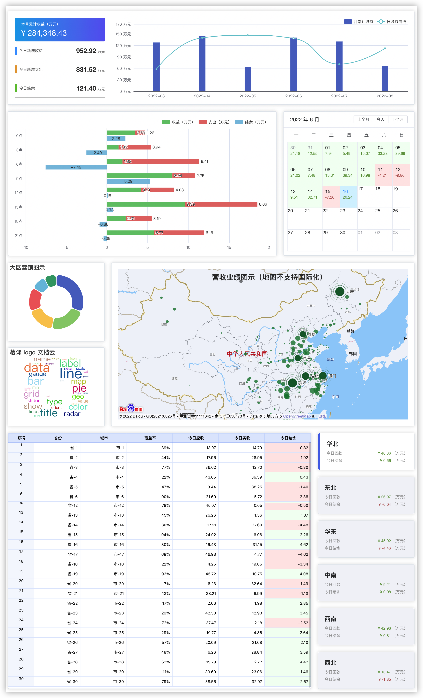

### 常见解决方案

 由刚才的介绍可知，无论哪一种应用场景，数据可视化其实核心就是：**通过图表展示数据**

那么明确了这个核心之后，我们其实就知道，所谓 **数据可视化解决方案** 指的其实就是：**通过图表展示数据的解决方案**

所以对应的核心就是：**如何构建图表** 。

目前常见的数据可视化图表，主要有三个：

1. [Apache ECharts](https://echarts.apache.org/zh/index.html)：由 [Apache软件基金会](https://zh.m.wikipedia.org/wiki/Apache软件基金会) 提供，前身是百度 `Echarts`。提供了 `PC端` 和 移动端 的各种图表处理，应该也是大家最为熟悉的一个可视化图表库。
2. [AntV](https://antv.vision/zh)：由蚂蚁集团数据可视化团队发布，内部进行了库的细分：
   1. [G2](https://g2.antv.vision/zh/examples/gallery)：类似于 `Echarts` ，提供了各种常见的图表
   2. [S2](https://s2.antv.vision/zh/examples/)：表格数据图形化，课程中的 **大区营销数据分析** ，就是基于此实现
   3. [G6](https://g6.antv.vision/zh/examples/gallery)：数据关系可视化。比如脑图实现
   4. [X6](https://x6.antv.vision/zh/examples/gallery)：图形编辑引擎。比如流程图、`ER` 图构建
   5. [L7](https://l7.antv.vision/zh/examples/gallery)：地理空间数据可视化。与地图相关
   6. [F2](https://f2.antv.vision/zh/examples/gallery)：移动端数据可视化。可以理解为 `G2` 的移动端版本
   7. [AVA](https://ava.antv.vision/zh/examples/gallery)：可视化生成框架。可以理解为可视化的低代码框架
3. [highcharts](https://www.highcharts.com/)：可以理解为另一个团队开发的 `Echarts` ，应用层中与 `Echarts` 相比，并无明显特点。

由此可知，对于以上三个框架而言，[Apache ECharts](https://echarts.apache.org/zh/index.html) 和 [AntV](https://antv.vision/zh) 是我们在真实企业开发中，最最常使用的数据可视化框架，所以我们的课程也将主要围绕这两个框架来完成。

### 不同场景下解决方案是否具备通用性

那么我们说到现在，可能很多同学就已经感觉到了，所谓的数据可视化，其实是有很多细层的划分的。无论是从 **应用场景中** 还是从 **解决方案中**。

那么可能有很多同学就说了，那么我如果想要成为数据可视化开发专家，是需要把这些场景和技术全部都学习一遍吗？

**当然不是！！**

我们首先要明确，技术向来都是有通用性的，解决方案同样如此。

大家还记不记得我们刚才说过：

> xxxx，数据可视化其实核心就是：**通过图表展示数据**
>
> xxxx，所谓 **数据可视化解决方案** 指的其实就是：**通过图表展示数据的解决方案**
>
> 所以对应的核心就是：**如何构建图表** 。

无论是 **大屏可视化** 也好，**数据可视化** 也好，`ECharts` 也好，`AntV` 也好。本质上都绕不开这样的一个核心理念。

所以我们只需要掌握：**如何根据数据，利用框架来绘制图表** 这样的一个核心解决方案即可。在不同的业务场景中，我们只需要处理对应的不同业务就可以了。

### 总结

那么这一小节，我们主要描述了三块内容，希望可以通过这三块内容来为大家解决一些数据可视化层面的疑惑，无论是技术上的，还是业务上的。

## 04：构建基础模块结构

那么从这一小节开始，我们就来处理对应的数据可视化代码部分。

先立个目标，在本小节中我们将会处理两件事情：

1. 在现有的路由表之中，新增一个 **公开路由 `chart`** ，表示咱们的数据可视化模块
2. 处理 `chart` 组件的基本结构，划分出各个图表的区域

### 新增 chart

1. 新建 `src/views/chart/index.vue` 组件

2. 在 `src/router/index.js` 中新增公开路由表：

   ```js
   {
           path: '/chart',
           name: 'chart',
           component: () =>
             import(/* webpackChunkName: "chart" */ '@/views/chart/index'),
           meta: {
             title: 'chart',
             icon: 'chart'
           }
         }
   ```

### 处理基本模块

根据以下结构，分别创建对应的图表模块：


1. 对应模块分别为：

   1. 第一行：
      1. 累计收益趋势图（`286px`）：`src/views/chart/components/trend/index.vue`
   2. 第二行：
      1. 日金额分析图（`443px`）：`src/views/chart/components/horizontal-bar/index.vue`
      2. 日历图（`443px`）：`src/views/chart/components/calendar/index.vue`
   3. 第三行：
      1. 饼图（`240px`）：`src/views/chart/components/pie/index.vue`
      2. 文档云图（`240px`）：`src/views/chart/components/word-cloud/index.vue`
      3. 地图可视化（`500px`）：`src/views/chart/components/b-map/index.vue`
   4. 第四行：
      1. `S2` 表格数据图示（`804px`）：`src/views/chart/components/table-sheet/index.vue`

2. 完成每个模块的基本初始化：

   ```vue
   <template>
     <div class="container">模块名字</div>
   </template>
   
   <script setup></script>
   
   <style lang="scss" scoped>
   .container {
     height: 对应模块高度;
     background-color: #bcbfc3;
   }
   </style>
   ```

3. 在 `src/views/chart/index.vue` 中导入各个模块，并构建样式：

   ```vue
   <template>
     <div class="chart-container">
       <!-- 累计收益趋势图 -->
       <trend-vue></trend-vue>
       <!-- 第二行 -->
       <el-row class="mt-20" :gutter="20">
         <el-col :span="16">
           <!-- 日金额分析图 -->
           <horizontal-bar-vue></horizontal-bar-vue>
         </el-col>
         <el-col :span="8">
           <!-- 日历图 -->
           <calendar-vue></calendar-vue>
         </el-col>
       </el-row>
       <!-- 第三行 -->
       <el-row class="mt-20" :gutter="20">
         <el-col :span="6">
           <!-- 左侧内容 -->
           <div class="chart-map-left">
             <!-- 饼图 -->
             <pie-vue></pie-vue>
             <!-- 文档云图 -->
             <word-cloud-vue class="mt-20"></word-cloud-vue>
           </div>
         </el-col>
         <el-col :span="18">
           <!-- 地图可视化 -->
           <b-map-vue></b-map-vue>
         </el-col>
       </el-row>
   
       <!-- S2 表格数据图示 -->
       <table-sheet-vue class="mt-20"></table-sheet-vue>
     </div>
   </template>
   
   <script setup>
   import trendVue from './components/trend'
   import horizontalBarVue from './components/horizontal-bar'
   import calendarVue from './components/calendar'
   import pieVue from './components/pie'
   import wordCloudVue from './components/word-cloud'
   import bMapVue from './components/b-map'
   import tableSheetVue from './components/table-sheet'
   </script>
   
   <style lang="scss" scoped>
   .mt-20 {
     margin-top: 20px;
   }
   </style>
   ```

## 05：累计收益-模块划分

在 `src/views/chart/components/trend/index.vue` 中，构建出左右两个模块，分别用来渲染：

1. 数据模块
2. 图表模块

具体代码如下：

1. 创建 `src/views/chart/components/trend/trend-chart.vue`

2. 创建 `src/views/chart/components/trend/trend-data.vue`

3. 在 `src/views/chart/components/trend/index.vue` 构建基本结构：

   ```vue
   <template>
     <el-card class="container">
       <el-row :gutter="32">
         <el-col :span="6">
           <trend-data-vue :data="chartTrendData" />
         </el-col>
         <el-col :span="18">
           <trend-chart-vue :data="chartTrendData" />
         </el-col>
       </el-row>
     </el-card>
   </template>
   
   <script setup>
   import trendDataVue from './trend-data.vue'
   import trendChartVue from './trend-chart.vue'
   </script>
   
   <style lang="scss" scoped>
   .container {
     height: 286px;
   }
   </style>
   ```

至此，模块划分完成

## 06：累计收益-数据模块渲染

结构划分完成之后，接下来我们渲染 `trend-data` 数据模块，该模块的基础渲染并不复杂，获取数据直接渲染即可。

1. 创建 `src/api/chart.js` 模块：

   ```js
   import request from '@/utils/request'
   
   /**
    * 获取累计收益明细
    */
   export const getChartTrend = () => {
     return request({
       url: '/chart/trend'
     })
   }
   ```

2. 因为该数据将会在 `chart` 和 `data` 中都被使用，所以我们在 `src/views/chart/components/trend/index.vue` 获取该数据：

   ```vue
   <script setup>
   ...
   import { getChartTrend } from '@/api/chart'
   import { ref } from 'vue'
   
   const chartTrendData = ref({})
   const getChartTrendData = async () => {
     const res = await getChartTrend()
     chartTrendData.value = res
   }
   getChartTrendData()
   </script>
   ```

3. 在 `template` 中控制 **获取到数据之后进行渲染**

   ```html
   <el-row :gutter="32" v-if="chartTrendData.allAmount">
   ```

4. 把数据传递给 `trend-data-vue`：

   ```html
   <trend-data-vue :data="chartTrendData" />
   ```

5. 在 `trend-data-vue` 中接收数据并进行渲染：

   ```vue
   <template>
     <div class="trend-data-container">
       <!-- 累计盈利 -->
       <div class="title">
         <div class="title-name">{{ $t('msg.chart.trendDataTitle') }}</div>
         <div class="title-amount">
           &yen;
           <span>{{ data.allAmount }}</span>
         </div>
       </div>
   
       <!-- 今日新增 -->
       <div class="item">
         <div class="item-name item-name-border-1">
           {{ $t('msg.chart.trendDataTadayAdded') }}
         </div>
         <div class="item-amount">
           <span class="item-amount-number">{{ data.tadayAdded }}</span>
           {{ $t('msg.chart.unit') }}
         </div>
       </div>
       <!-- 今日支出 -->
       <div class="item">
         <div class="item-name item-name-border-2">
           {{ $t('msg.chart.trendDataTadayExpend') }}
         </div>
         <div class="item-amount">
           <span class="item-amount-number">{{ data.tadaySub }}</span>
           {{ $t('msg.chart.unit') }}
         </div>
       </div>
       <!-- 今日结余 -->
       <div class="item">
         <div class="item-name item-name-border-3">
           {{ $t('msg.chart.trendDataTadayBalance') }}
         </div>
         <div class="item-amount">
           <span class="item-amount-number">{{ data.tadayAmount }}</span>
           {{ $t('msg.chart.unit') }}
         </div>
       </div>
     </div>
   </template>
   
   <script setup>
   import { defineProps } from 'vue'
   
   defineProps({
     data: {
       type: Object,
       required: true
     }
   })
   </script>
   
   <style lang="scss" scoped>
   .trend-data-container {
     .title {
       padding: 12px 20px;
       background: linear-gradient(to right, #0ea5e9, #6366f1);
       border-radius: 5px;
       color: white;
       .title-name {
         font-size: 12px;
         font-weight: bold;
       }
       .title-amount {
         font-size: 24px;
         margin-top: 4px;
       }
     }
   
     .item {
       display: flex;
       justify-content: space-between;
       align-items: center;
       border-bottom: 1px solid #c9c9c9;
       padding: 16px 0;
       color: #666;
       .item-name {
         font-size: 12px;
         padding: 4px 0 4px 8px;
       }
       .item-amount {
         font-size: 12px;
         .item-amount-number {
           color: #333;
           font-weight: bold;
           font-size: 20px;
         }
       }
   
       .item-name-border-1 {
         border-left: 6px solid #409eff;
       }
       .item-name-border-2 {
         border-left: 6px solid #e6a23c;
       }
       .item-name-border-3 {
         border-left: 6px solid #67c23a;
       }
     }
   }
   </style>
   ```

至此，基础模块渲染完成

## 07：countup - 让你的数据动起来

数字直接展示，在数据可视化场景中未免不太好看。

所以我们期望让数字以动画的形式进行展示。

如果想要达到这样的目的，则需要借助：[countUp](https://github.com/inorganik/countUp.js) 进行实现。

1. 安装 [countUp](https://github.com/inorganik/countUp.js)：

   ```shell
   npm i --save countup.js@2.2.0
   ```

2. [countUp](https://github.com/inorganik/countUp.js) 的使用非常简单，我们只需要 `new CountUp(target, data, options)` ，得到实例触发 `start` 方法即可：

   ```vue
   <script setup>
   import { CountUp } from 'countup.js'
   import { onMounted, ref, defineProps } from 'vue'
   
   ....
   
   // 本月累计收益（万元）
   const titleAmountTarget = ref(null)
   // 今日新增收益
   const tadayAddedTarget = ref(null)
   // 今日新增支出
   const tadayExpendTarget = ref(null)
   // 今日结余
   const tadayBalanceTarget = ref(null)
   onMounted(() => {
     const options = {
       // 小数点位
       decimalPlaces: 2,
       // 持续时间
       duration: 1.5
     }
     // 累计回款
     new CountUp(titleAmountTarget.value, props.data.allAmount, options).start()
     // 今日新增
     new CountUp(tadayAddedTarget.value, props.data.tadayAdded, options).start()
     // 今日支出
     new CountUp(tadayExpendTarget.value, props.data.tadaySub, options).start()
     // 今日结余
     new CountUp(tadayBalanceTarget.value, props.data.tadayAmount, options).start()
   })
   </script>
   ```

​  不要忘记在 `template` 中定义对应的 `ref`！

## 08：ECharts 使用指南与学习方案

处理好数据展示之后，接下来我们来处理右侧的图表，该图表我们将基于 `ECharts` 来完成，所以 **想要处理图表，首先需要先学习 `ECharts` ！**

安装 `ECharts` ，我们这里使用 `5.3.2` 的版本：

```shell
npm i --save echarts@5.3.2
```

[点击进入 echarts 官网](https://echarts.apache.org/zh/index.html)

参考 [基础入门](https://echarts.apache.org/handbook/zh/get-started/) 完成基本的柱状图渲染。

由基础案例可以，想要利用 `ECharts` 完成基本的图表渲染，共分为 5 步：

1. 创建 `DOM` 容器，并指定大小（指定 `ref` 方便获取）

2. 导入 `ECharts` 模块：

   ```js
   import * as echarts from 'echarts'
   ```

3. 利用 `echarts.init(target)` 方法，获取 `mChart` 实例：

   ```js
   const target = ref(null)
   let mChart
   onMounted(() => {
     mChart = echarts.init(target.value)
   })
   ```

4. 构建 `options` 配置对象（ **`echarts` 渲染的核心，不同的 `options` 意味着不同的图表体现** ）

   ```js
   const options = {
     // 图表标题配置  
     title: {
       // 标题文本   
       text: 'ECharts 入门示例'
     },
     // 图例配置
     legend: {
       // 图例数据
       data: ['销量']
     },
     // X 轴配置
     xAxis: {
       // 数据
       data: ['衬衫', '羊毛衫', '雪纺衫', '裤子', '高跟鞋', '袜子']
     },
     // Y 轴配置
     yAxis: [{}],
     // 图表类型（可以指定多个）
     series: [
       {
         // 图表名字，对应 legend.data[0]
         name: '销量',
         // 图表的类型
         type: 'bar',
         // 图表的数据
         data: [5, 20, 36, 10, 10, 20]
       }
     ]
   };
   ```

5. 最后利用 `mChart.setOption` 方法配置 `options`

   ```
   mChart.setOption(options)
   ```

6. 最终完整代码为：

   ```vue
   <template>
     <div class="trend-chart-container" ref="target"></div>
   </template>
   
   <script setup>
   import * as echarts from 'echarts'
   import { ref, onMounted } from 'vue'
   
   const target = ref(null)
   let mChart
   onMounted(() => {
     mChart = echarts.init(target.value)
     renderChart()
   })
   
   /**
    * 图表渲染方法
    */
   const renderChart = () => {
     const options = {
       // 图表标题配置
       title: {
         // 标题文本
         text: 'ECharts 入门示例'
       },
       // 图例配置
       legend: {
         // 图例数据
         data: ['销量']
       },
       // X 轴配置
       xAxis: {
         // 数据
         data: ['衬衫', '羊毛衫', '雪纺衫', '裤子', '高跟鞋', '袜子']
       },
       // Y 轴配置
       yAxis: [{}],
       // 图表类型（可以指定多个）
       series: [
         {
           // 图表名字，对应 legend.data[0]
           name: '销量',
           // 图表的类型
           type: 'bar',
           // 图表的数据
           data: [5, 20, 36, 10, 10, 20]
         }
       ]
     }
     mChart.setOption(options)
   }
   </script>
   
   <style lang="scss" scoped>
   .trend-chart-container {
     height: 100%;
   }
   </style>
   ```

通过以上代码我们可知：

1. 对于 `ECharts` 而言，开发流程几乎固定（5 步）
2. 渲染图表的关键是 `options` 配置对象
3. 配置对象可通过 [配置项手册](https://echarts.apache.org/zh/option.html#title) 进行查看

最后，想要学习 `ECharts` 怎么办？

答：需要经常 **参考对照 [配置项手册](https://echarts.apache.org/zh/option.html#title)** ！

## 09：累计收益-柱状图与曲线图的混合渲染

接下来我们就通过数据来渲染 **累计收益图表**

1. 传递数据到 `src/views/chart/components/trend/trend-chart.vue` 中：

   ```js
   const props = defineProps({
     data: {
       type: Object,
       required: true
     }
   })
   ```

2. 在 `src/views/chart/components/trend/index.vue` 中完成传递：

   ```html
   <trend-chart-vue :data="chartTrendData" />
   ```

3. 根据数据构建全新的 `options` 配置对象：

   ```js
   const options = {
       // 鼠标移入之后的提示框配置
       tooltip: {
         // 鼠标移入到坐标轴时，触发提示框
         trigger: 'axis',
         // 移入坐标轴时，提示框的配置项
         axisPointer: {
           // 显示十字准星指示器
           type: 'cross',
           // 指示器样式
           crossStyle: {
             // 色值
             color: '#999'
           }
         }
       },
       // 图例配置
       legend: {
         // 图例数据
         data: ['月累计收益', '日收益曲线'],
         // 图例位置
         right: 0
       },
       // echarts 网格绘制的位置，对应 上、右、下、左
       grid: {
         top: 20,
         right: 0,
         bottom: 0,
         left: 0,
         // 计算边距时，包含标签
         containLabel: true
       },
       // X 轴配置
       xAxis: {
         // 坐标轴类型，category：类目轴
         type: 'category',
         // 坐标轴数据
         data: props.data.monthAmountList.map(item => item.time),
         // 刻度尺配置
         axisTick: {
           // 不显示坐标轴刻度
           show: false
         }
       },
       // y 轴配置
       yAxis: {
         // Y 轴类型，value：数值轴
         type: 'value',
         // 最小值
         min: 0,
         // 最大值
         max: function(value) {
           // 取整
           return parseInt(value.max * 1.2)
         },
         // 刻度上展示的文字
         axisLabel: {
           formatter: '{value} 万元'
         }
       },
       // 图表类型
       series: [
         // 第一个图表
         {
           // 图表名字，对应 legend.data[0]
           name: '月累计收益',
           // 图表类型
           type: 'bar',
           // 柱的宽度
           barWidth: 20,
           // 提示框展示配置
           tooltip: {
             // 提示框展示的内容
             valueFormatter: function(value) {
               return value + '万元'
             }
           },
           // 数据源
           data: props.data.monthAmountList.map(item => item.amount)
         },
         // 第二个图表
         {
           // 图表名字，对应 legend.data[1]
           name: '日收益曲线',
           // 图表类型
           type: 'line',
           // 颜色
           color: '#6EC6D0',
           // 平滑
           smooth: true,
           // 提示框展示配置
           tooltip: {
             // 提示框展示的内容
             valueFormatter: function(value) {
               return value + '万元'
             }
           },
           // 数据源
           data: props.data.dailyCurve.map(item => item.amount)
         }
       ]
     }
   ```

   那么至此，混合图表渲染完成。

## 10：累计收益-混合图表的国际化处理

最后对于累计收益模块，我们需要处理 **混合图表的国际化展示**。

我们知道，想要国际化的处理其实被分为两种情况：

1. 在 `template` 中，利用 `$t` 方法处理国际化。这种情况下，当我们切换 `locale` 的时候，内容会自动重新渲染。就像在 `trend-data` 时一样。
2. 在 `script` 中，利用 `i18n.t` 方法处理国际化。在这种情况下，当我们切换 `locale` 的时候，需要通过 `watchSwitchLang` 方法，监听语言变化，再利用 `i18n.t` 重新获取最新的语言内容才可以。

那么我们当前就处于 **场景二** 之中。

据此，具体代码如下：

1. 生成 `i18n` 实例：

   ```js
   import { useI18n } from 'vue-i18n'
   
   const i18n = useI18n()
   ```

2. 修改固定文本为 `i18n.t` 方法：

   ```js
   const options = {
       ...
       // 图例配置
       legend: {
         // 图例数据
         data: [i18n.t('msg.chart.monthIncome'), i18n.t('msg.chart.dayIncome')],
         ...
       },
      ...
       // y 轴配置
       yAxis: {
        ...
         // 刻度上展示的文字
         axisLabel: {
           formatter: `{value} ${i18n.t('msg.chart.unit')}`
         }
       },
       // 图表类型
       series: [
         // 第一个图表
         {
           // 图表名字，对应 legend.data[0]
           name: i18n.t('msg.chart.monthIncome'),
          ...
           tooltip: {
             // 提示框展示的内容
             valueFormatter: function(value) {
               return value + i18n.t('msg.chart.unit')
             }
           },
           ...
         },
         // 第一个图表
         {
           // 图表名字，对应 legend.data[1]
           name: i18n.t('msg.chart.dayIncome'),
          ...
           tooltip: {
             // 提示框展示的内容
             valueFormatter: function(value) {
               return value + i18n.t('msg.chart.unit')
             }
           },
           ...
         }
       ]
     }
   ```

3. 最后通过 `watchSwitchLang` 方法，重新触发 `renderChart`：

   ```js
   import { watchSwitchLang } from '@/utils/i18n'
   
   watchSwitchLang(renderChart)
   ```

## 11：日历模块-日历数据基础渲染

在 `src/views/chart/components/calendar/index.vue` 中，利用 [element-plus 的 calendar](https://element-plus.org/zh-CN/component/calendar.html) 组件完成日历基本渲染：

```vue
<template>
  <el-card
    class="container"
    :body-style="{
      padding: 0
    }"
  >
    <el-calendar class="calendar" v-model="currentDate">
      <template #dateCell="{ data }">
        <p :class="[data.isSelected ? 'is-selected' : '']">
          <!-- 显示的内容 -->
          {{
            data.day
              .split('-')
              .slice(2)
              .join('')
          }}
          <br />
        </p>
      </template>
    </el-calendar>
  </el-card>
</template>

<script setup>
import { ref } from 'vue'

// 选中的日期
const currentDate = ref(new Date())
</script>

<style lang="scss" scoped>
.container {
  height: 443px;
  .calendar {
    ::v-deep .el-calendar__body {
      padding: 0 12px 12px;
      font-size: 14px;
    }
    ::v-deep .el-calendar-day {
      height: 66px !important;
      padding: 0 !important;
      p {
        height: 100%;
        padding: 8px;
      }
      // 金额样式
      .amount {
        font-size: 12px;
      }
      // 正收益
      .profit {
        background-color: #f3fff3;
        span {
          color: #649840;
        }
      }
      // 负收益
      .loss {
        background-color: #ffe7e7;
        span {
          color: #b65d59;
        }
      }

      .is-selected {
        background-color: #d6f2ff;
      }
    }
  }
}
</style>
```

至此，基础的日历模块渲染完成。

## 12：日历模块-定制数据可视化处理

1. 在 `src/api/chart.js` 中定义日历图示数据接口：

   ```js
   /**
    * 日历图示数据
    */
   export const getChartCalendar = () => {
     return request({
       url: '/chart/calendar'
     })
   }
   ```

2. 在 `src/views/chart/components/calendar/index.vue` 中获取数据：

   ```vue
   <script setup>
   import { ref } from 'vue'
   import { getChartCalendar } from '@/api/chart'
   
   /**
    * 获取数据
    */
   const calendarListData = ref([])
   const getCalendarListData = async () => {
     const { result } = await getChartCalendar()
     calendarListData.value = result
   }
   getCalendarListData()
   </script>
   ```

3. 创建方法 `getTadayAmount`，用于：**返回指定日期收益数据，在日历中进行展示**：

   ```js
   /**
    * 返回指定日期收益数据，在日历中进行展示
    */
   const getTadayAmount = date => {
     // 根据日期，获取当日数据
     const tadayData = calendarListData.value.find(item => item.date === date)
     // 判断当日数据是否存在
     if (!tadayData) {
       return 0
     }
     // 获取当日收益
     const tadayAmount = tadayData.amount
     return tadayAmount
   }
   ```

4. 在 `template` 中，添加当日金额视图：

   ```html
   <template #dateCell="{ data }">
     <p :class="[data.isSelected ? 'is-selected' : '']">
       <!-- 显示的内容 -->
       ...
       <br />
       <!-- 当日金额 -->
       <span class="amount" v-if="getTadayAmount(data.day)">
         {{ getTadayAmount(data.day) }}
       </span>
     </p>
   </template>
   ```

5. 为避免 `getTadayAmount` 被多次计算，创建简单的缓存处理：

   ```js
   // 收益缓存数据。
   // key 为日期
   // val 为对应的 金额
   const dateAmountList = ref({})
   /**
    * 返回指定日期收益数据，在日历中进行展示
    */
   const getTadayAmount = date => {
     // 读取缓存数据
     if (dateAmountList.value[date]) {
       return dateAmountList.value[date]
     }
     ...
   
     // 对数据进行缓存
     dateAmountList.value[date] = tadayAmount
   
     return tadayAmount
   }
   ```

6. 至此，**日历中可展示每日金额收益**

7. 最后我们期望为 **正收益添加 `profit`** 样式，为 **负收益添加 `loss`** 样式

8. 创建 `calendarItemBgClass` 方法，处理对应样式行为：

   ```js
   /**
    * 返回日历的背景
    * */
   const calendarItemBgClass = day => {
     if (getTadayAmount(day) > 0) {
       return 'profit'
     } else if (getTadayAmount(day) < 0) {
       return 'loss'
     }
     return ''
   }
   ```

9. 在 `template` 中使用此方法：

   ```diff
   <template #dateCell="{ data }">
     <p
       :class="[
         data.isSelected ? 'is-selected' : '',
   +      calendarItemBgClass(data.day)
       ]"
     >
   ```

至此：基于日历图的数据渲染完成。

## 13：日金额分析-横向与负坐标图表构建

接下来我们来处理日金额分析模块。

对于该模块而言，同样以 **柱状图** 的形式呈现，然而不同的是，它是一个横向的，并且具备负数。

所以说在本小节中我们需要构建一个 **横向，包含负数的柱状图**。以此对比 **累计收益** 的柱状图，相信可以让大家对 `ECharts` 的图表绘制有更深的理解。

1. 在 `src/api/chart.js` 中创建数据获取方法：

   ```js
   /**
    * 指定日期的时段柱形数据
    */
   export const getChartTimeAmount = date => {
     return request({
       url: '/chart/time/amount',
       params: {
         date
       }
     })
   }
   ```

2. 在 `src/views/chart/components/horizontal-bar/index.vue` 中获取接口数据：

   ```vue
   <script setup>
   import { getChartTimeAmount } from '@/api/chart'
   import { ref } from 'vue'
   
   /**
    * 获取数据
    */
   const data = ref([])
   const getData = async date => {
     const { result } = await getChartTimeAmount(date)
     data.value = result
     // 渲染图表
   }
   getData()
   </script>
   ```

3. 根据数据绘制图表，同时处理国际化内容：

   ```vue
   <script setup>
   import { getChartTimeAmount } from '@/api/chart'
   import * as echarts from 'echarts'
   import { onMounted, ref } from 'vue'
   // 国际化相关
   import { useI18n } from 'vue-i18n'
   import { watchSwitchLang } from '@/utils/i18n'
   const i18n = useI18n()
   
   ...
   
   /**
    * 图表初始化
    */
   const target = ref(null)
   let mChart = null
   onMounted(() => {
     mChart = echarts.init(target.value)
   })
   
   /**
    * 构建图表
    */
   const renderChart = () => {
     const options = {
       // 鼠标移入之后的提示框配置
       tooltip: {
         // 鼠标移入到坐标轴时，触发提示框
         trigger: 'axis',
         // 移入坐标轴时，提示框的配置项
         axisPointer: {
           // 指示器展示阴影
           type: 'shadow'
         }
       },
       // 图例配置
       legend: {
         // 图例数据
         data: [
           `${i18n.t('msg.chart.income')}（${i18n.t('msg.chart.unit')}）`,
           `${i18n.t('msg.chart.expend')}（${i18n.t('msg.chart.unit')}）`,
           `${i18n.t('msg.chart.balance')}（${i18n.t('msg.chart.unit')}）`
         ],
         // 图例位置
         right: 0
       },
       // echarts 网格绘制的位置，对应 上、右、下、左
       grid: {
         top: 28,
         right: 0,
         bottom: 0,
         left: 0,
         // 计算边距时，包含标签
         containLabel: true
       },
       // X 轴配置
       xAxis: [
         {
           // 数值轴，适用于连续数据
           type: 'value'
         }
       ],
       // y 轴配置
       yAxis: [
         {
           // 坐标轴类型，category：类目轴
           type: 'category',
           // 刻度尺配置
           axisTick: {
             // 不显示坐标轴刻度
             show: false
           },
           // Y 轴数据
           data: data.value.map(item => item.timeStr),
           // 反向展示
           inverse: true
         }
       ],
       // 图表类型
       series: [
         // 第一个图表：收益
         {
           // 图表名字，对应 legend.data[0]
           name: `${i18n.t('msg.chart.income')}（${i18n.t('msg.chart.unit')}）`,
           // 图表类型
           type: 'bar',
           // 数据堆叠，两个相同的 stack 将会堆叠渲染
           stack: 'Total',
           // 标签配置
           label: {
             // 展示
             show: true,
             // 右侧
             position: 'right'
           },
           // 柱的颜色
           color: '#6DC473',
           // 高亮配置
           emphasis: {
             // 聚焦当前高亮的数据所在的系列的所有图形
             focus: 'series'
           },
           // 数据
           data: data.value.map(item => item.income)
         },
         // 第二个图表：支出
         {
           // 图表名字，对应 legend.data[1]
           name: `${i18n.t('msg.chart.expend')}（${i18n.t('msg.chart.unit')}）`,
           // 图表类型
           type: 'bar',
           // 数据堆叠，两个相同的 stack 将会堆叠渲染
           stack: 'Total',
           // 标签配置
           label: {
             // 展示
             show: true,
             // 右侧
             position: 'right'
           },
           // 柱的颜色
           color: '#E47470',
           // 高亮配置
           emphasis: {
             // 聚焦当前高亮的数据所在的系列的所有图形
             focus: 'series'
           },
           // 数据
           data: data.value.map(item => item.expense)
         },
         // 第三个图表：结余
         {
           // 图表名字，对应 legend.data[2]
           name: `${i18n.t('msg.chart.balance')}（${i18n.t('msg.chart.unit')}）`,
           // 图表类型
           type: 'bar',
           // 标签配置
           label: {
             // 展示
             show: true,
             // 内部
             position: 'inside'
           },
           // 柱的颜色
           color: '#83C0DF',
           // 高亮配置
           emphasis: {
             // 聚焦当前高亮的数据所在的系列的所有图形
             focus: 'series'
           },
           // 数据
           data: data.value.map(item => item.balance)
         }
       ]
     }
     mChart.setOption(options)
   }
   
   watchSwitchLang(renderChart)
   </script>
   ```

4. 最后对样式进行修正：

   ```vue
   <template>
     <el-card
       :body-style="{
         paddingTop: '12px'
       }"
     >
       <div class="container" ref="target"></div>
     </el-card>
   </template>
   
   <style lang="scss" scoped>
   .container {
     height: 403px;
   }
   </style>
   ```

至此，日金额分析模块渲染完成。

## 14：非父子组件之间进行交互的三种方式

在 `Vue` 的项目中，涉及到组件之间通讯，通常会有两种场景：

1. 父子组件通讯：这也是我们最常见的一种场景，可以通过 `props` 或 `emits` 来完成。
2. 非父子组件通讯：这种情况相对比较复杂，因为两个无关的组件进行通讯必须要找到一个 **“沟通者”** ，这个沟通者必须可以与双方都进行通讯。通常情况下有三种方式：
   1. 找到双方共同的父组件：通过子向父通讯，父向子通讯的方式
      1. 优点：以现有技术即可完成
      2. 缺点：大量的跨组件处理事件，会导致逻辑变得非常复杂，各个组件之间的耦合性变强
   2. 借助 `vuex`：因为 `vuex` 是可以与所有组件都进行交互的，所以可以借助它承担 “沟通者” 的角色
      1. 优点：以现有技术即可完成
      2. 缺点：数据必须由 `Vuex` 处理，如果该数据之前没有存放在 `Vuex` 中，则需要进行较大的改动
   3. 事件中心 `EventHub`：所谓事件中心其实就有一个 **公开的单例**，一般会提供 `emits 发送事件` 和 `on 监听事件` 两个方法。在 `Vue2` 中 `vm` 实例因为直接具备这两个方法，所以可以直接作为事件中心实例。而在 `Vue3` 中，取消了 `on` 方法，所以如果想要实现这种机制，则需要通过 [mitt](https://github.com/developit/mitt) 来进行实现。
      1. 优点：有利于组件之间的解耦，增加可维护性
      2. 缺点：当事件足够多时，会导致事件中心极其复杂

那么综上所述，我们可知：**如果只是进行少量的非父子组件通讯，那么通过 `EventHub` 的形式处理** 是比较好的。

所以说，在接下来的 **日历图与柱状图联动处理** 中，我们将会通过 **事件中心 `EventHub`** 的方式来完成。

## 15：跨组件通讯-日历图与柱状图联动处理

根据上一小节所述，我们知道在本小节中，我们将会通过 **事件中心 `EventHub`** 来处理跨组件通讯。

1. 安装  [mitt](https://github.com/developit/mitt)：

   ```shell
   npm i --save mitt@3.0.0
   ```

2. 创建 `src/utils/eventHub.js`，作为事件中心：

   ```js
   import mitt from 'mitt'
   
   /**
    * 注意：
    * 这种方式在 Vue3 中，已经没有原生的实现，可以借助 mitt 进行实现。但是这种方式并不适合大范围的使用，因为很有可能会导致出现事件紊乱的错误。
    */
   export default mitt()
   ```

3. 在 `src/views/chart/components/calendar/index.vue` 中，监听 `currentDate` 的变化，发送事件：

   ```js
   import emitter from '@/utils/eventHub'
   // 选中的日期
   const currentDate = ref(new Date())
   
   /**
    * 触发日期改变的事件
    */
   watch(currentDate, val => {
     emitter.emit('calendarChange', val)
   })
   ```

4. 在 `src/views/chart/components/horizontal-bar/index.vue` 中，通过 `on` 方法监听事件：

   ```js
   /**
    * 与日历图联通
    */
   emitter.on('calendarChange', val => {
     getData(val)
   })
   ```

至此，日历图与柱状图联动完成。

## 16：大区营销-饼图图表构建

接下来我们来通过饼图展示大区营销数据。

相信大家经过前面的学习之后，饼图的绘制对于大家而言，应该并不是一个复杂的点了。

大家可以先尝试 **通过查看 `ECharts` 文档的形式，自己先实现一下饼图的绘制**，实现完成之后，再来学习本章，作为一个验证的过程，这种方式也是极好的。

那么下面我们就来看一下饼图的绘制：

1. 在 `src/api/chart.js` 中定义数据接口：

   ```js
   /**
    * 饼图数据
    */
   export const getChartPie = () => {
     return request({
       url: '/chart/pie'
     })
   }
   ```

2. 在 `src/views/chart/components/pie/index.vue` 中通过接口获取数据：

   ```js
   <script setup>
   import { ref } from 'vue'
   import { getChartPie } from '@/api/chart'
   
   const chartData = ref([])
   const getChartData = async () => {
     const res = await getChartPie()
     chartData.value = res
     // 渲染图表
   }
   getChartData()
   </script>
   ```

3. 构建基础的 `html`:

   ```vue
   <template>
     <el-card
       :body-style="{
         padding: 0
       }"
     >
       <div ref="target" class="container"></div>
     </el-card>
   </template>
   
   <style lang="scss" scoped>
   .container {
     height: 240px;
   }
   </style>
   ```

4. 渲染图表，并处理国际化内容：

   ```js
   <script setup>
   import { onMounted, ref } from 'vue'
   import * as echarts from 'echarts'
   import { getChartPie } from '@/api/chart'
   import { useI18n } from 'vue-i18n'
   import { watchSwitchLang } from '@/utils/i18n'
   
   const i18n = useI18n()
   
   ...
   
   const target = ref(null)
   let mChart = null
   onMounted(() => {
     mChart = echarts.init(target.value)
   })
   
   const renderChart = () => {
     const options = {
       // 标题
       title: {
         text: i18n.t('msg.chart.pieChartTitle')
       },
       // 鼠标移入的提示
       tooltip: {
         trigger: 'item',
         // {b}：数据名。{c}：数值。
         formatter: `{b}: {c} ${i18n.t('msg.chart.unit')}`
       },
       series: [
         {
           // 饼图
           type: 'pie',
           // 饼图的半径。第一项为内半径，第二项为外半径
           radius: ['40%', '70%'],
           // 每个 item 的样式
           itemStyle: {
             // 圆角
             borderRadius: 10,
             // 边框色
             borderColor: '#fff',
             // 边框宽度
             borderWidth: 2
           },
           // 文字
           label: {
             // 默认不显示
             show: false,
             // {b}：数据名。{d}：百分比。
             formatter: '{b}: {d}%',
             // 居中展示（在鼠标移入时）
             position: 'center'
           },
           // 高亮状态的扇区和标签样式
           emphasis: {
             // 文本
             label: {
               show: true,
               fontSize: '22',
               fontWeight: 'bold'
             }
           },
           data: chartData.value
         }
       ]
     }
   
     mChart.setOption(options)
   }
   watchSwitchLang(renderChart)
   </script>
   ```

至此，饼图渲染完成。

## 17：文档云图-WordCloud 基础渲染

对于 `ECharts` 而言，默认并没有提供文档云图的图表渲染，如果我们想要渲染文档云图的话，那么需要借助另外一个包：[echarts-wordcloud](https://github.com/ecomfe/echarts-wordcloud)

对于该包的使用非常简单，只需要在需要渲染文档云图时，指定：`import 'echarts-wordcloud';` 导入即可。

1. 安装 `echarts-wordcloud`：

   ```shell
   npm install echarts-wordcloud@2.0.0
   ```

2. 定义文档云图数据接口：

   ```js
   /**
    * 文字云图数据
    */
   export const getChartWordCloud = () => {
     return request({
       url: '/chart/wordcloud'
     })
   }
   ```

3. 在 `src/views/chart/components/word-cloud/index.vue` 中获取数据：

   ```js
   /**
    * 获取数据
    */
   const wordCloudData = ref([])
   const getWordCloudData = async () => {
     const res = await getChartWordCloud()
     wordCloudData.value = res
     // 渲染图表
   }
   getWordCloudData()
   ```

4. 构建基本的 `html` 和 `css`：

   ```vue
   <template>
     <el-card
       :body-style="{
         padding: 0
       }"
     >
       <div class="container" ref="target"></div>
     </el-card>
   </template>
   
   <style lang="scss" scoped>
   .container {
     height: 240px;
   }
   </style>
   ```

5. 渲染图表：

   ```vue
   <script setup>
   import * as echarts from 'echarts'
   import 'echarts-wordcloud'
   import { ref, onMounted } from 'vue'
   import { randomRGB } from '@/utils/color'
   import { getChartWordCloud } from '@/api/chart.js'
   import { useI18n } from 'vue-i18n'
   import { watchSwitchLang } from '@/utils/i18n'
   
   const i18n = useI18n()
   
   ...
   
   const target = ref(null)
   let mChart = null
   onMounted(() => {
     mChart = echarts.init(target.value)
   })
   
   /**
    * 渲染图表
    */
   const renderChart = () => {
     var option = {
       title: {
         text: i18n.t('msg.chart.cloudChartTitle')
       },
       series: [
         {
           // 类型
           type: 'wordCloud',
           // 数据映射文本的大小范围
           sizeRange: [4, 80],
           // 文字旋转范围
           rotationRange: [0, 0],
           // 单词之间的间距
           gridSize: 0,
           // 渲染动画
           layoutAnimation: true,
           // 字体
           textStyle: {
             // 随机色值
             color: randomRGB
           },
           // 高亮字体
           emphasis: {
             textStyle: {
               fontWeight: 'bold',
               color: '#000'
             }
           },
           // 数据
           data: wordCloudData.value
         }
       ]
     }
   
     mChart.setOption(option)
   }
   
   watchSwitchLang(renderChart)
   </script>
   ```

6. 创建 `src/utils/color.js` ，暴露 `randomRGB` 方法：

   ```js
   /**
    * 生成随机色值
    */
   export const randomRGB = () => {
     const r = Math.floor(Math.random() * 255)
     const g = Math.floor(Math.random() * 255)
     const b = Math.floor(Math.random() * 255)
     return `rgb(${r}, ${g}, ${b})`
   }
   ```

至此，基础的文档云图渲染完成。

## 18：文档云图-基于图形轮廓的绘制

目前咱们的文档云图已经绘制完成，但是目前的文档云图是有点难看的，我们期望它能够：**在绘制文档的同时，预留出 `imooc` 的一个 `logo` 图形**

那么如果想要实现这个功能，则需要借助 `wordCloud` 的 `maskImage` 属性，通过该属性指定图形轮廓。

1. 在 `renderChart` 中，构建 `img` 实例：

   ```js
   import wordcloudBg from '@/assets/wordcloud.png'
   
   // 图像轮廓
   var maskImage = new Image()
   maskImage.src = wordcloudBg
   ```

2. 在 `series` 配置属性中，指定 `maskImage`：

   ```js
   // 绘制将排除图像的轮廓
   maskImage: maskImage,
   ```

3. **等待图像加载完成之后**，再设置 `Option`：

   ```js
   // 等待图像加载完成之后
   maskImage.onload = function() {
     mChart.setOption(option)
   }
   ```

此时，绘制的文档即预留了指定的图形轮廓。

## 19：地图可视化：百度地图 API 大解析

接下来我们需要处理的是营收业绩图示，也就是地图可视化。

对于地图可视化而言，我们将使用百度地图结合 `ECharts` 进行绘制。

所以说想要完成地图可视化，首先我们需要：**申请百度地图应用**：

申请百度地图应用，将分为两部分讲解：

1. 注册开发者
2. 申请应用

### 注册开发者

1. 打开 [百度地图 API](https://lbsyun.baidu.com/)
2. 点击右上角登录按钮：
   

3. 选择立即注册（百度系账号通用）：
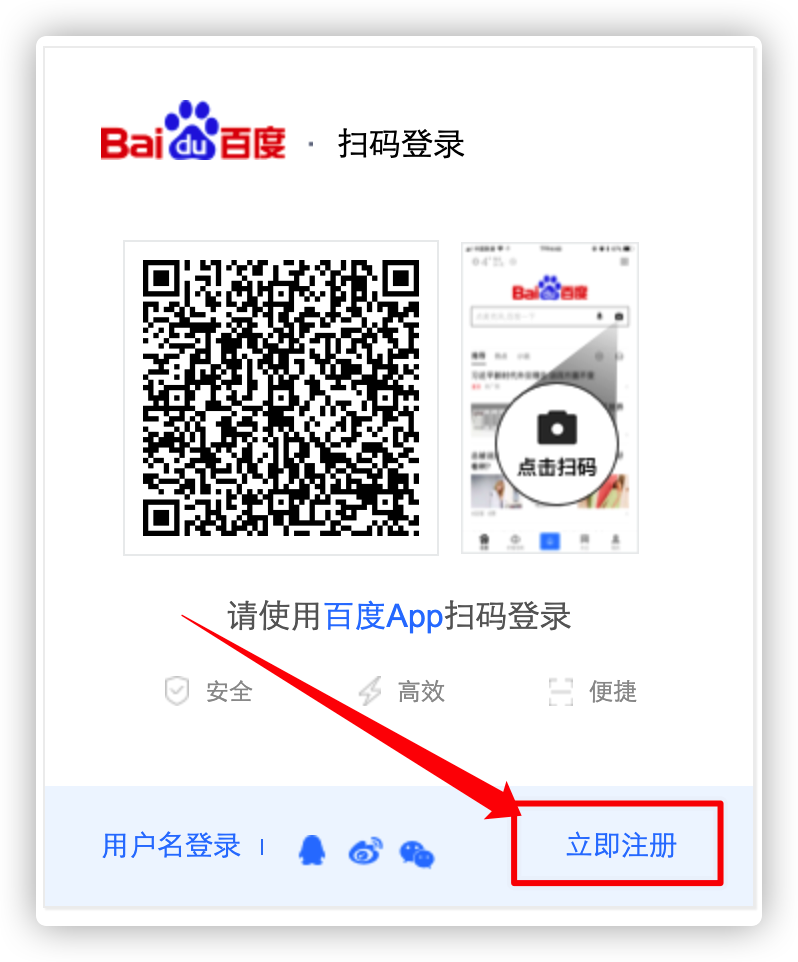

4. 完成注册：
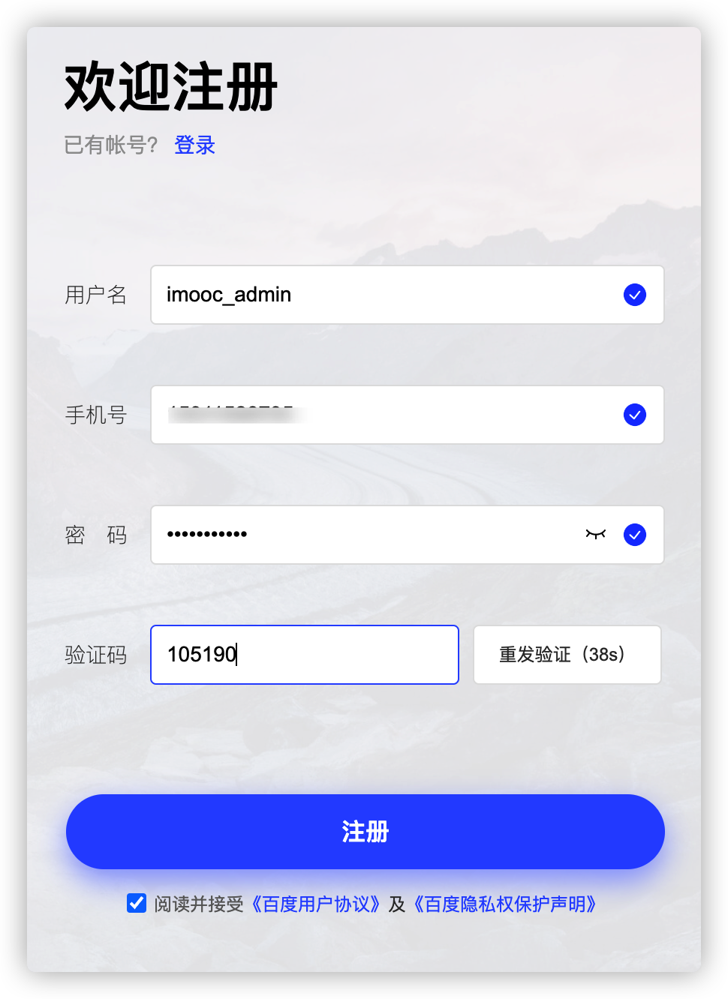

5. 账号注册成功之后，重新进入 [百度地图 API](https://lbsyun.baidu.com/) 平台
6. 点击控制台，注册称为开发者：


7. 咱们这里选择 **个人开发者**：
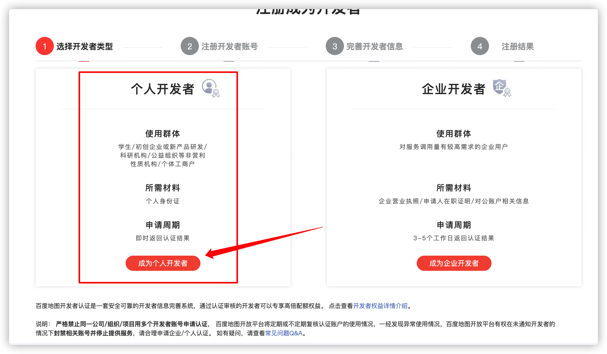

8. 同意即可：
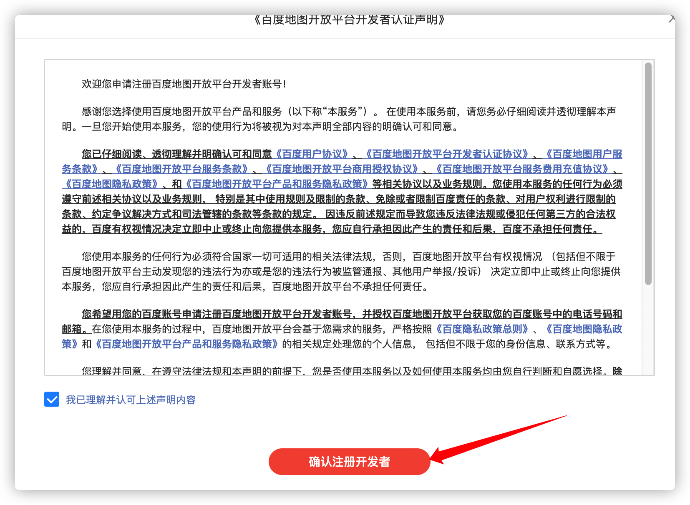

9. 填写开发者信息：
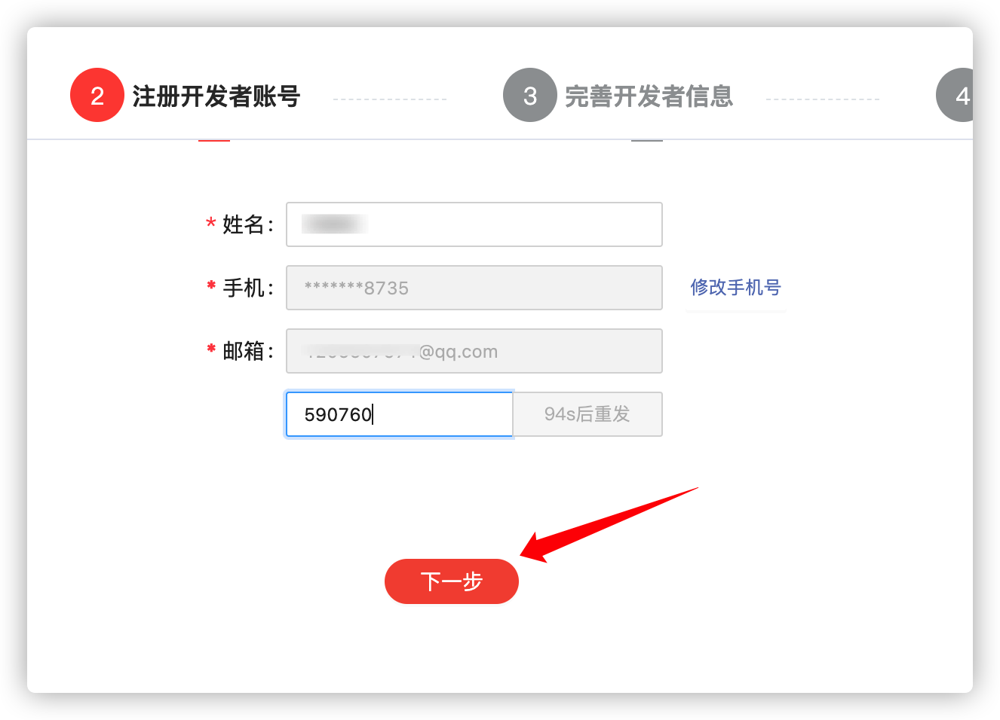
10. 完善基本信息：
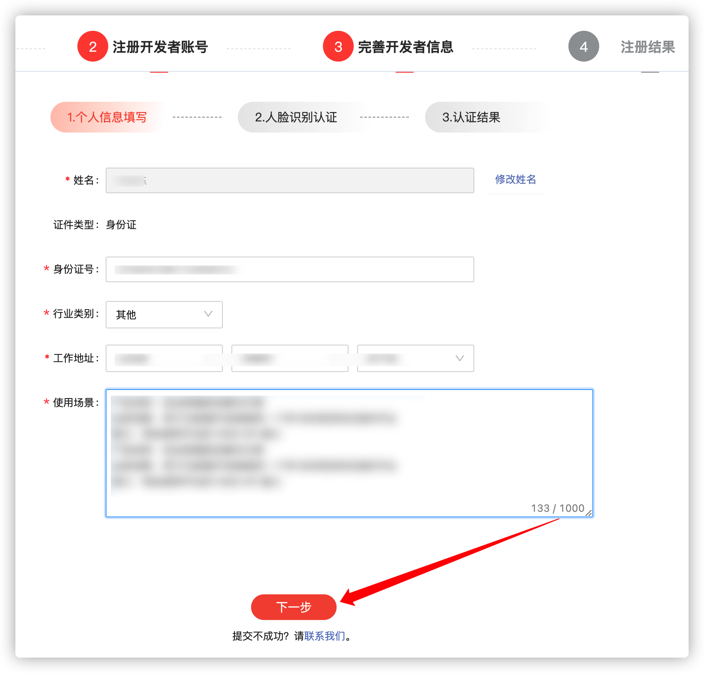
11. 上传身份证信息：
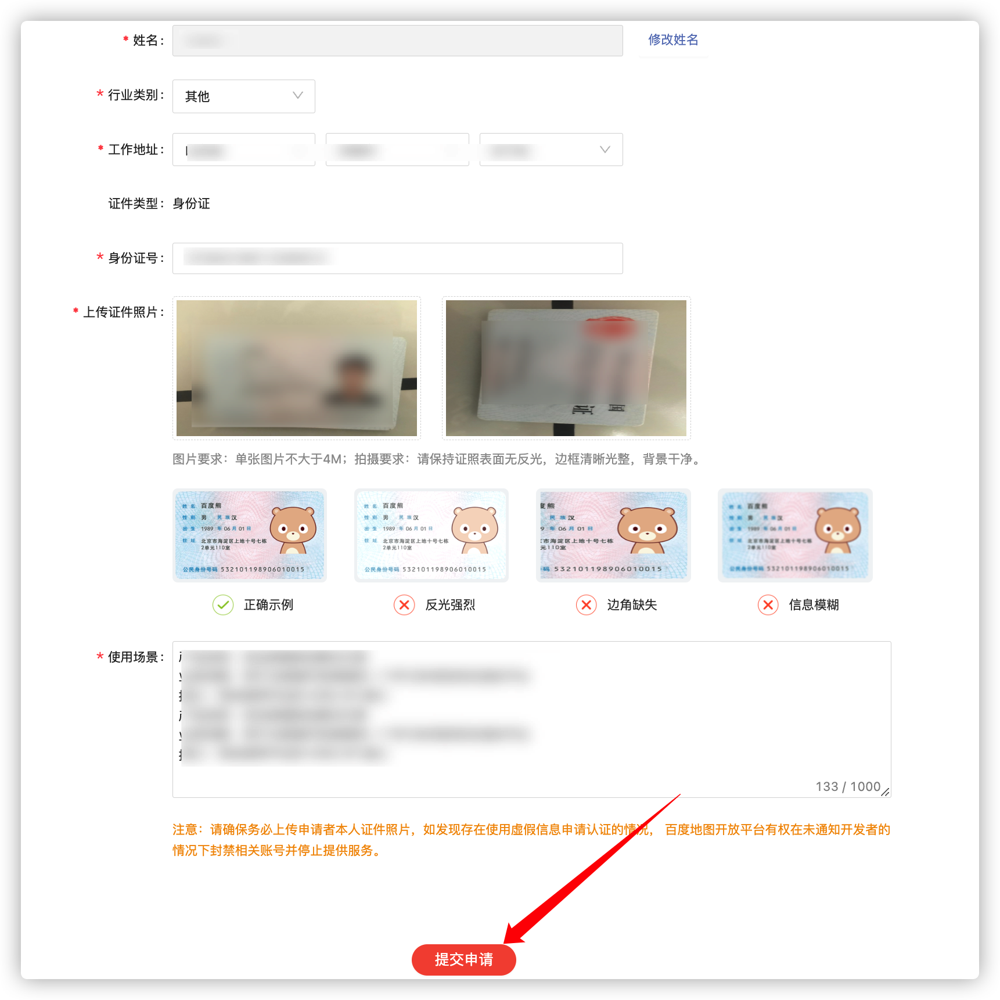

12. 因为我这边已经注册过了，所以只能进行到这个位置，后面就是最后一步，注册成功了。
13. 注册成功之后，个人开发者应该是即时就可以生效的。

至此，**开发者信息创建完成**

接下来我们就需要创建对应的：**应用信息**

### 申请应用

1. 登录账号之后，点击控制台，此时可以进入控制台页面
2. 点击 **应用管理 -> 我的应用** ，选择 **创建应用**
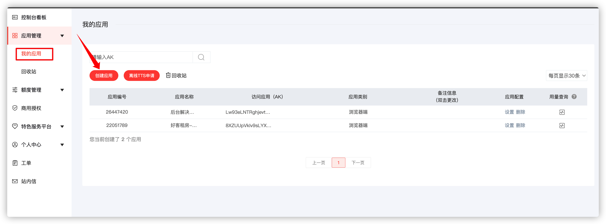

3. 填入基本应用信息，**重点：注意 `Referer白名单`** ，因为这个应用可能会被很多同学使用，所以我们填写的是 `*` ！ ：
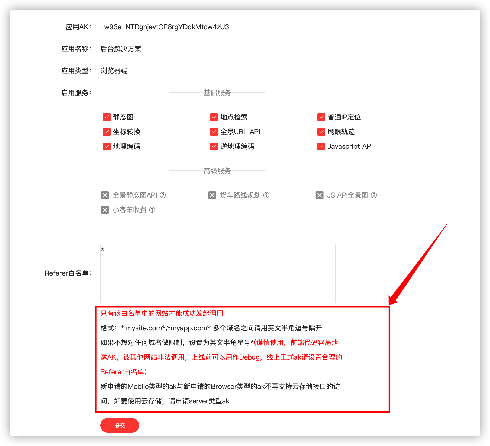

4. 点击提交，应用创建完成，此时我们可以得到一个 **`访问应用（AK）`**：`Lw93eLNTRghjevtCP8rgYDqkMtcw4zU3`
5. 大家如果不愿意走那么麻烦的注册流程，那么可以直接使用该 `AK`

那么到这里我们就已经完成了百度地图的应用创建，并且得到了对应的 `AK`。

那么有了此 `AK`，之后，接下来我们就可以完成对应的地图可视化渲染了。

## 20：地图可视化：百度地图 + ECharts 完成可视化渲染

想要完成地图可视化，那么需要结合 **百度地图** 和 `ECharts` 的 `bmap.js` 模块才可以。

1. 在 `public/index.html` 中，导入百度地图 `API` （通用`AK`：`Lw93eLNTRghjevtCP8rgYDqkMtcw4zU3`）：

   ```html
     <script src="https://api.map.baidu.com/api?v=3.0&ak=${此处写入你的 AK }"></script>
   ```

2. 在 `src/api/chart.js` 中，定义地图可视化数据接口：

   ```js
   /**
    * 地图可视化
    */
   export const getChartMap = () => {
     return request({
       url: '/chart/bmap'
     })
   }
   ```

3. 在 `src/views/chart/components/b-map/index.vue` 中，获取对应数据：

   ```js
   /**
    * 获取数据
    */
   const chartData = ref({})
   const getChartData = async () => {
     const res = await getChartMap()
     chartData.value = res
     // 渲染图表
   }
   getChartData()
   ```

4. **注意：** 此时服务端返回的数据包含两个属性：

   1. `data`：所有的城市和对应数据
   2. `geoCoordMap`：所有城市和对应坐标

5. 该数据是 **不可以** 直接在地图可视化中进行渲染的，所以我们需要对该数据进行 **重置**：

6. 期望重置为该格式数据：
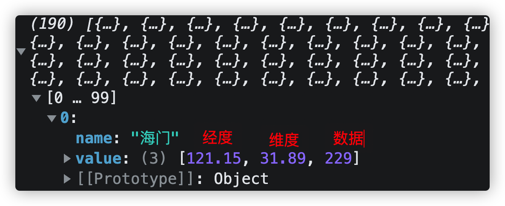

7. 所以得出以下算法：

   ```js
   /**
    * 数据转化方法
    */
   const convertData = function (data) {
     // 返回值
     const res = []
     // 遍历所有城市数据
     data.forEach((item) => {
       // 根据城市名从 geoCoordMap 中获取对应坐标
       const geoCoord = chartData.value.geoCoordMap[item.name]
       // 如果可以获取到坐标，则生成新的数据对象
       if (geoCoord) {
         // 该数据对象为：
         // name：城市名
         // value：数组[经度、维度、数据]
         res.push({
           name: item.name,
           value: [...geoCoord, item.value]
         })
       }
     })
     return res
   }
   ```

8. 构建 `HTML` 和 `CSS` 结构：

   ```vue
   <template>
     <el-card
       class="container"
     >
       <div class="title">{{ $t('msg.chart.bmapChartTitle') }}</div>
       <div ref="target" class="box"></div>
     </el-card>
   </template>
   
   <style lang="scss" scoped>
   .container {
     position: relative;
     .title {
       position: absolute;
       top: 28px;
       margin-left: 50%;
       transform: translateX(-50%);
       color: #333;
       font-size: 22px;
       font-weight: bold;
       z-index: 9;
     }
     .box {
       height: 462px;
     }
   }
   </style>
   ```

9. 导入 `ECharts` 中处理地图模块 `bmap`：

   ```js
   // 导入 bmap 模块
   import 'echarts/extension/bmap/bmap.js'
   ```

10. 完成图表渲染：

    ```js
    const i18n = useI18n()
    
    /**
     * 初始化 echarts
     */
    const target = ref(null)
    let mChart = null
    onMounted(() => {
      mChart = echarts.init(target.value)
    })
    
    /**
     * 渲染地图数据
     */
    const renderBMap = () => {
      const options = {
        tooltip: {
          trigger: 'item'
        },
        // 地图配置
        bmap: {
          // 中心点
          center: [109.114129, 36.550339],
          // 缩放级别
          zoom: 5,
          // 是否可拖动
          roam: true
        },
        series: [
          {
            name: `营收（${i18n.t('msg.chart.unit')}）`,
            // 散点图
            type: 'scatter',
            // 使用的表坐标
            coordinateSystem: 'bmap',
            // 数据源
            data: convertData(chartData.value.data),
            // 散点的大小
            symbolSize: function (val) {
              return val[2] / 10
            },
            // 数据使用下标为2的值（item.value[2]）
            encode: {
              value: 2
            },
            // 鼠标移入时，高亮的标签样式
            emphasis: {
              label: {
                // 鼠标移入时，显示高亮
                show: true
              }
            },
            // 散点色值
            color: '#15803d'
          },
          {
            name: `营收 TOP 5（${i18n.t('msg.chart.unit')}）`,
            // 包含涟漪特效动画的散点的散点图
            type: 'effectScatter',
            // 使用的表坐标
            coordinateSystem: 'bmap',
            // 数据源（top 5）
            data: convertData(
              chartData.value.data
                .sort(function (a, b) {
                  return b.value - a.value
                })
                .slice(0, 6)
            ),
            // 散点的大小
            symbolSize: function (val) {
              return val[2] / 10
            },
            // 数据使用下标为2的值（item.value[2]）
            encode: {
              value: 2
            },
            // 涟漪特效
            rippleEffect: {
              // stroke 类型的波纹
              brushType: 'stroke'
            },
            // 显示地名
            label: {
              formatter: '{b}',
              position: 'right',
              show: true
            },
            // 散点层级
            zlevel: 2,
            // 散点色值
            color: '#166534'
          }
        ]
      }
      mChart.setOption(options)
    }
    ```

至此，地图可视化渲染完成。

到此时，我们基于 `ECharts` 来实现的可视化内容，就已经全部完成。

接下来我们就将会基于 `AntV` 的 `S2` 模块，来实现 **大区营销数据分析** 图示！

## 21：大区营销数据分析-基础结构渲染

对于大区营销模块而言，首先我们需要先把它的基础结构进行渲染。

1. 创建 `src/views/chart/components/table-sheet/components/s2.vue` 作为图表渲染组件

   ```vue
   <template>
     <el-card
       :body-style="{
         padding: 0
       }"
     >
       <div class="container" ref="target">s2</div>
     </el-card>
   </template>
   
   <script setup></script>
   
   <style lang="scss" scoped>
   .container {
     height: 782px;
   }
   </style>
   ```

2. 创建 `src/views/chart/components/table-sheet/components/sheet-label.vue` 作为大区渲染组件

   ```vue
   <template>
     <el-card
       :body-style="{
         padding: 0
       }"
     >
       <div class="container">sheet-label</div>
     </el-card>
   </template>
   
   <script setup></script>
   
   <style lang="scss" scoped>
   .container {
     height: 112px;
   }
   </style>
   ```

3. 在 `src/views/chart/components/table-sheet/index.vue` 中，渲染对应结构：

   ```vue
   <template>
     <el-row :gutter="20">
       <el-col :span="18">
         <s2Vue />
       </el-col>
       <el-col :span="6">
         <sheetLabelVue v-for="item in 6" :key="item" class="mb-20" />
       </el-col>
     </el-row>
   </template>
   
   <script setup>
   import s2Vue from './components/s2.vue'
   import sheetLabelVue from './components/sheet-label.vue'
   </script>
   
   <style lang="scss" scoped>
   .mb-20 {
     margin-bottom: 20px;
   }
   </style>
   ```

至此，渲染出基本的结构模块。

## 22：大区营销数据分析-渲染大区结构视图

本小节我们来渲染右侧大区结构视图。

1. 在 `src/api/chart.js` 中定义大区数据获取接口：

   ```js
   /**
    * 大区数据
    */
   export const getChartRegions = () => {
     return request({
       url: '/chart/regions'
     })
   }
   ```

2. 在 `src/views/chart/components/table-sheet/index.vue` 中获取数据，渲染视图：

   ```js
   import { getChartRegions } from '@/api/chart'
   import { ref } from 'vue'
   import { watchSwitchLang } from '@/utils/i18n'
   
   /**
    * 获取大区数据
    */
   const regionsData = ref([])
   const getChartRegionsData = async () => {
     const { regions } = await getChartRegions()
     regionsData.value = regions
     // TODO：获取该大区对应的数据
   }
   getChartRegionsData()
   // 切换语言，数据重新获取
   watchSwitchLang(getChartRegionsData)
   ```

   ```html
   <sheetLabelVue
     :data="item"
     v-for="item in regionsData"
     :key="item.id"
     class="mb-20"
   />
   ```

3. 在 `src/views/chart/components/table-sheet/components/sheet-label.vue` 中渲染数据：

   ```vue
   <template>
     <el-card
       class="mb-20"
       :body-style="{
         padding: 0
       }"
     >
       <div class="container">
         <p class="title">{{ data.title }}</p>
         <div class="desc">
           <span>{{ $t('msg.chart.tadayReceivable') }}</span>
           <p class="profit">
             &yen; {{ data.receivable }}
             <span class="unit">（{{ $t('msg.chart.unit') }}）</span>
           </p>
         </div>
         <div class="desc">
           <span>{{ $t('msg.chart.tadayBalance') }}</span>
           <p :class="data.balance > 0 ? 'profit' : 'loss'">
             &yen; {{ data.balance }}
             <span class="unit">（{{ $t('msg.chart.unit') }}）</span>
           </p>
         </div>
       </div>
     </el-card>
   </template>
   
   <script setup>
   import { defineProps } from 'vue'
   
   defineProps({
     // 数据源
     data: {
       type: Object,
       required: true
     }
   })
   </script>
   
   <style lang="scss" scoped>
   .container {
     padding: 20px;
     border-radius: 5px;
     background-color: #f2f3f9;
     cursor: pointer;
     .title {
       font-size: 18px;
       font-weight: bold;
       margin-bottom: 8px;
     }
   
     .desc {
       font-size: 12px;
       margin-top: 6px;
       color: #999;
       display: flex;
       justify-content: space-between;
     }
   
     .unit {
       color: #999;
     }
   
     .profit {
       color: #649840;
     }
   
     .loss {
       color: #b65d59;
     }
   }
   </style>
   ```

4. 基本视图渲染完成

5. 接下来处理高亮点击行为

6. 在 `src/views/chart/components/table-sheet/components/sheet-label.vue` 中定义：

   ```js
   defineProps({
     // 是否被选中
     isSelected: {
       type: Boolean
     },
     ...
   })
   ```

   ```html
   <div class="container " :class="{ selected: isSelected }">
   ```

   ```css
   .selected {
     border-left: 6px solid #5172e9;
     background-color: white;
   }
   ```

7. 在 `src/views/chart/components/table-sheet/index.vue` 中，定义选中数据：

   ```vue
   <template>
     ...
         <sheetLabelVue
           :isSelected="currentRegionsIndex === index"
           @click="onChangeRegion(index)"
           ...
         />
       ...
   </template>
   
   <script setup>
   ...
   /**
    * 获取大区数据
    */
   const currentRegionsIndex = ref(0)
   ...
   
   /**
    * 切换大区
    */
   const onChangeRegion = (index) => {
     currentRegionsIndex.value = index
     // TODO：获取该大区对应的数据
   }
   </script>
   ```

至此，大区结构视图渲染完成。

## 23：大区营销数据分析-基于 AntV S2 构建表格数据可视化

接下来我们将基于 [AntV S2 模块](https://s2.antv.vision/zh/examples/gallery) 来实现我们的表格数据可视化逻辑。

1. 首先安装 `@antv/s2` 到项目中：

   ```shell
   npm i --save @antv/s2@1.19.0
   ```

2. `s2` 的使用整体分为 6 步：

   1. 按需导入 `TableSheet` 模块
   2. 创建 `DOM` 作为渲染的容器，并且需要指定宽高
   3. 构建 [S2DataConfig](https://s2.antv.vision/zh/docs/api/general/S2DataConfig) 对象，为表的数据源
   4. 构建 [S2Options](https://s2.antv.vision/zh/docs/api/general/S2Options) 对象，为表的配置对象
   5. 生成 [TableSheet](https://s2.antv.vision/zh/docs/manual/basic/sheet-type/table-mode#tablesheet-%E7%B1%BB%E6%96%B9%E5%BC%8F) 实例，得到 `S2`
   6. 触发 `s2.render()` 方法，完成表的渲染

3. 那么明确好了这 6 步之后，接下来我们就进行一下对应的实现。

### 基础渲染

1. 在 `src/api/chart.js` 中，定义数据接口：

   ```js
   /**
    * 表格数据
    */
   export const getChartSheet = regionId => {
     return request({
       url: '/chart/sheets',
       params: {
         regionId
       }
     })
   }
   ```

2. 在 `src/views/chart/components/table-sheet/index.vue` 获取对应数据：

   ```js
   import { getChartSheet } from '@/api/chart'
   /**
    * 大区对应的表格数据
    */
   const sheetData = ref([])
   const getChartSheetData = async id => {
     const res = await getChartSheet(id)
     sheetData.value = res
   }
   getChartSheetData()
   ```

3. 在 `src/views/chart/components/table-sheet/components/s2.vue` 中定义 `props` 接收数据：

   ```js
   const props = defineProps({
     data: {
       type: Array,
       required: true
     }
   })
   ```

4. 在 `src/views/chart/components/table-sheet/index.vue` 中传递数据：

   ```html
   <s2Vue :data="sheetData" />
   ```

5. 在 `src/views/chart/components/table-sheet/components/s2.vue` 中获取指定 `DOM`，并生成 `s2` 实例：

   ```vue
   <script setup>
   import { ref, watch, defineProps, onMounted } from 'vue'
   import { TableSheet } from '@antv/s2'
   import { useI18n } from 'vue-i18n'
   
   const i18n = useI18n()
   
   const props = defineProps({
     data: {
       type: Array,
       required: true
     }
   })
   
   const target = ref(null)
   let s2 = null
   onMounted(() => {
     // 数据对象
     const s2DataCfg = {
       fields: {
         columns: [
           'province',
           'city',
           'coverage',
           'receivable',
           'actual',
           'balance'
         ]
       },
       meta: [
         // 列头字段对应的元信息，比如展示的中文名
         {
           field: 'province',
           name: i18n.t('msg.chart.sheetProvince')
         },
         {
           field: 'city',
           name: i18n.t('msg.chart.sheetCity')
         },
         {
           field: 'coverage',
           name: i18n.t('msg.chart.sheetCoverage')
         },
         {
           field: 'receivable',
           name: i18n.t('msg.chart.sheetReceivable')
         },
         {
           field: 'actual',
           name: i18n.t('msg.chart.sheetActual')
         },
         {
           field: 'balance',
           name: i18n.t('msg.chart.sheetBalance')
         }
       ],
       data: props.data
     }
     // 配置对象
     const s2Options = {
       // 宽度：必须为准确的像素
       width: target.value.clientWidth,
       // 高度：必须为准确的像素
       height: target.value.clientHeight,
       // 是否显示行序号
       showSeriesNumber: true,
       // 条件模式配置
       conditions: {
         // 背景字段标记
         background: [
           {
             // 设置背景的字段
             field: 'balance',
             // 映射函数
             mapping(fieldValue) {
               console.log(fieldValue)
               return {
                 fill: fieldValue > 0 ? '#f3fff3' : '#ffe7e7'
               }
             }
           }
         ]
       }
     }
     // 生成 S2 实例
     s2 = new TableSheet(target.value, s2DataCfg, s2Options)
     // 渲染视图
     s2.render(true)
   })
   </script>
   ```

至此基础表格渲染成功

## 24：大区营销数据分析-表格图谱与大区联动

当表格渲染成功之后，下面我们要处理表格和大区的联动，我们期望，当切换不同大区时，表格的数据可以切换展示。

1. 在大区数据获取完成后，触发 `getChartSheetData` 方法：

   ```js
   const getChartRegionsData = async () => {
     ...
     // TODO：获取该大区对应的数据
     getChartSheetData(regionsData.value[0].id)
   }
   ```

2. 在 `onChangeRegion` 切换大区时，重新触发 `getChartSheetData` 方法：

   ```diff
   /**
    * 切换大区
    */
   const onChangeRegion = (index) => {
     currentRegionsIndex.value = index
     // TODO：获取该大区对应的数据
   +  getChartSheetData(regionsData.value[index].id)
   }
   ```

3. 在 `src/views/chart/components/table-sheet/components/s2.vue` 中，监听 `data` 的变化，触发 `render` 函数：

   ```js
   onMounted(() => {
     // 配置对象
     const s2Options = {
      ...
     }
     // 生成 S2 实例，数据对象置为 null
     s2 = new TableSheet(target.value, {}, s2Options)
   })
   
   /**
    * 图标渲染函数
    */
   const renderChart = () => {
     // 数据对象
     const s2DataCfg = {
      ...
     }
   
     // 更新数据
     s2.setDataCfg(s2DataCfg)
     // 渲染视图，传入 true 表示数据发生了更新
     s2.render(true)
   }
   
   /**
    * 监听数据变化
    */
   watch(
     () => props.data,
     () => {
       renderChart()
     }
   )
   ```

4. 此时，表格与大区联动完成。

5. 最后处理下国际化内容：

   ```js
   /**
    * 监听语言变化
    */
   watchSwitchLang(renderChart)
   ```

至此，基于 `S2` 的大区营销数据分析图表渲染完成。

## 25：总结

那么到这里咱们的整个的 **数据可视化** 加餐模块就已经全部讲解完成了。

新增的加餐内容，并没有提供 **大屏可视化** 的对应内容，因为就像我们之前所说的 **大屏可视化** 主要以单独的项目进行展示，并不适合集成到后台解决方案之中。另外，也是最重要的一点：**大屏可视化与数据可视化在解决方案中，并没有本质的区别。**

好，那么祝大家学习愉快，我是 `Sunday`，咱们下次再见！
